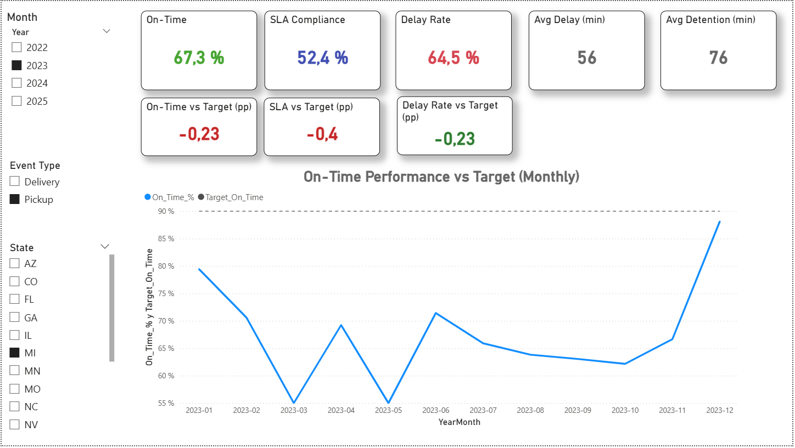
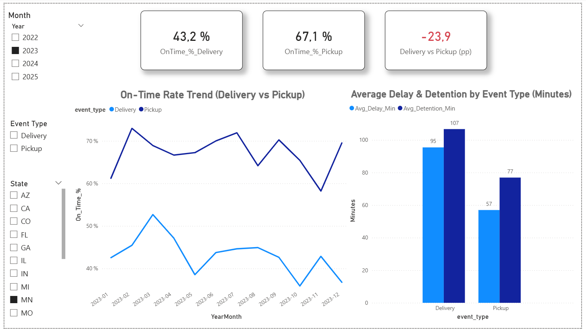
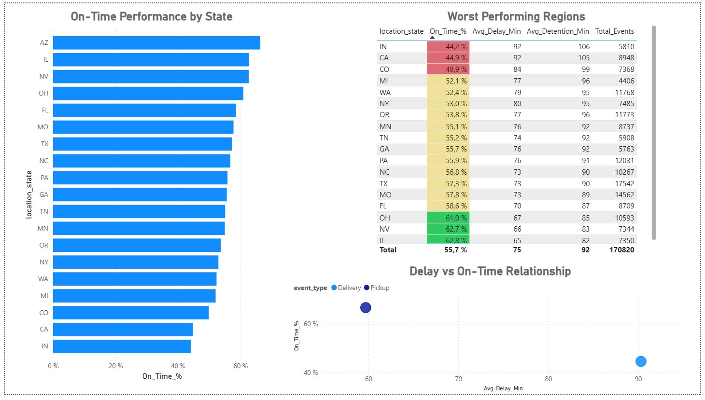

# Logistics Operational KPI Dashboard (Power BI)

## Project Overview

This project analyzes logistics operational performance using KPI monitoring and risk segmentation techniques.  
The objective is to provide decision-makers with a structured analytical framework to evaluate on-time performance, delay patterns, and operational risk exposure.

The dashboard is structured into three analytical pages:

- Executive Overview  
- Event Type Analysis  
- Operational Risk Analysis  

## Business Context

Logistics operations require continuous monitoring of service levels, delay rates, and SLA compliance.  
Without structured KPI tracking, operational inefficiencies and risk concentration remain difficult to detect.

This dashboard transforms raw operational data into executive-level insights.

## Business Problem Statement

- Limited visibility into overall on-time performance  
- Lack of structured breakdown by event type  
- No consolidated view of delay and detention impact  
- Difficulty identifying operational risk concentration  

## KPI Framework Definition

Key performance indicators included:

- On-Time Delivery %  
- On-Time Pickup %  
- SLA Compliance %  
- Delay Rate %  
- Average Delay (minutes)  
- Average Detention (minutes)  
- Performance vs Target (percentage points)

Each KPI supports operational monitoring and management decision-making.

## Dashboard Structure

### 1. Executive Overview

Provides a high-level summary of operational performance, SLA compliance, and delay indicators.

### 2. Event Type Analysis

Breakdown of operational events by delivery and pickup categories to identify performance gaps and delay patterns.

### 3. Operational Risk Analysis

Detailed view of performance distribution by state and operational segment to detect risk concentration.

## Data Model Architecture

The data model follows clean analytical design principles:

- Fact table containing operational event records  
- Dimension tables for time, state, and event type  
- Optimized relationships for drill-down analysis  
- DAX measures for KPI calculations  

## Analytical Findings

- Pickup performance significantly outperforms delivery performance.  
- Delay rates remain structurally high compared to SLA targets.  
- Certain states show concentrated underperformance patterns.  
- Detention times contribute significantly to operational inefficiency.  

## Business Implications

- Need for targeted performance improvement in delivery operations  
- SLA compliance requires corrective operational measures  
- Geographic performance segmentation enables focused interventions  
- Continuous KPI monitoring improves strategic decision-making  

## Strategic Recommendations

- Implement targeted improvement plans for underperforming states  
- Monitor delay root causes by event type  
- Strengthen SLA tracking and exception management  
- Introduce proactive performance dashboards for operations teams  

## Technical Stack

- Power BI  
- Power Query (Data Transformation)  
- DAX (KPI Calculations)  
- Star Schema Data Modeling  

## Author

Fiorella  
Business Informatics Student  
Aspiring Data & Business Analyst

